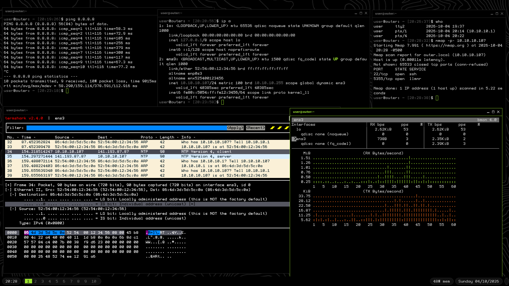

<div align="center">

# ✦ 01-Radiobox ✦


</div>

---

## About

4eArch-Openbox is a lightweight Arch Linux virtual machine built to log and view network information. It runs a minimal Openbox desktop under QEMU/KVM with GPU acceleration and is attached to the host network through a bridge (`vmbr0`), so it sits on the same network it observes with its own address.

A single script, `master_setup.sh`, turns a fresh Arch install into the full machine: packages, folders, services, firewall, desktop, terminal, editor and shell are all configured automatically.

---

## Screenshots

| Preview |
| :---: |
|  |
|  |
|  |

---

## Host Requirements

- QEMU with KVM support (`qemu-system-x86_64`)
- A GPU and driver stack that supports virgl (`virtio-vga-gl` with OpenGL display)
- A network bridge named `vmbr0` on the host
- `qemu-bridge-helper` permitted to use that bridge, by adding this line to `/etc/qemu/bridge.conf`:

```
allow vmbr0
```

---

## Building the Image

1. Create a blank raw disk image (adjust the size as needed):

```bash
mkdir -p ~/Documents/Misc/machines
qemu-img create -f raw ~/Documents/Misc/machines/01_Radio.img 40G
```

2. Boot the Arch Linux installer ISO against the image:

```bash
qemu-system-x86_64 -enable-kvm -m 4G -smp 2 -cpu host \
  -drive file=~/Documents/Misc/machines/01_Radio.img,format=raw \
  -cdrom ~/Downloads/archlinux-x86_64.iso -boot d \
  -device virtio-vga-gl -display gtk,gl=on \
  -netdev bridge,id=net0,br=vmbr0 -device virtio-net-pci,netdev=net0
```

3. Install the base system onto the disk (`archinstall` or a manual install), including `base`, `linux`, `linux-firmware`, `grub`, `sudo`, `git` and `openssh`. Create a normal user with sudo rights.

4. Reboot into the installed system, log in as that user, then clone this repository and run the setup script:

```bash
git clone <repository-url>
cd arch_01_Radio_arch
chmod +x master_setup.sh
./master_setup.sh
```

5. Copy a wallpaper to the path the desktop expects, then reboot:

```bash
cp Radio_wall_1.jpg ~/Pictures/Wallpapers/1.jpg
sudo reboot
```

The script asks you to choose a font during the run. Run it as your normal user, not as root, since it uses `sudo` where needed and writes to your home directory.

---

## Running the Machine

Add this alias to your shell configuration on the host:

```bash
alias 01='sleep 5s ; qemu-system-x86_64 -enable-kvm -m 4G -smp 2 -cpu host -drive file=~/Documents/Misc/machines/01_radio.img,format=raw -device virtio-vga-gl -display gtk,gl=on -netdev bridge,id=net0,br=vmbr0 -device virtio-net-pci,netdev=net0 & disown'
```

Then start the machine with:

```bash
a1
```

| Option | Meaning |
| :--- | :--- |
| `-enable-kvm` | Hardware acceleration through KVM |
| `-m 4G` | 4 GB of RAM |
| `-smp 2` | 2 virtual CPU cores |
| `-cpu host` | Pass the host CPU model through |
| `-drive file=...,format=raw` | The raw disk image `01_Radio.img` |
| `-device virtio-vga-gl` | Virtio GPU with OpenGL acceleration |
| `-display gtk,gl=on` | GTK window with OpenGL enabled |
| `-netdev bridge,...` | Bridged networking on `vmbr0` |
| `-device virtio-net-pci` | Virtio network card |

---

## What the Setup Script Does

| Step | Action |
| :--- | :--- |
| Core packages | Full system update, then installs Xorg and the Openbox desktop stack |
| User directories | Creates the folder layout shown below and runs `xdg-user-dirs-update` |
| User packages | Installs terminal tools, applications and the network tools, then asks for a font |
| Services | Enables the `ly` login manager, `ufw` and `sshd` |
| Firewall | Denies incoming, allows outgoing, allows SSH, then enables `ufw` |
| Openbox | Writes autostart, `.xinitrc`, 10 desktops, keybindings, root menu and environment |
| Alacritty | Writes `alacritty.toml` using the font you picked |
| Git | Sets `main` as default branch and uses `delta` as the pager |
| Default apps | Sets `nemo`, `firefox`, `imv` and `mpv` as defaults for their file types |
| Tint2 | Writes the bottom panel config with desktops, tray, clock, date and memory |
| Neovim | Writes `init.lua` with built-in autopairs, folds, undo history and clipboard support |
| Bash | Backs up the old `.bashrc` to `.bashrc.bak`, then writes a new one |

---

## Packages Installed

| Category | Packages |
| :--- | :--- |
| Xorg | `xorg-server`, `xorg-xinit`, `xorg-xsetroot`, `xorg-xset`, `xorg-setxkbmap`, `xdg-user-dirs`, `xdg-utils` |
| Desktop | `openbox`, `tint2`, `feh`, `obconf-qt`, `lxappearance`, `rofi`, `ly` |
| Terminal and shell tools | `alacritty`, `fzf`, `eza`, `bat`, `btop`, `pfetch`, `zoxide`, `yazi`, `man-db`, `man-pages` |
| Development | `git`, `git-delta`, `neovim` |
| Applications | `firefox`, `nemo`, `imv`, `mpv` |
| Screenshots and clipboard | `maim`, `slop`, `clipmenu`, `xclip`, `xdotool` |
| Security and access | `ufw`, `openssh` |
| Network tools | `tcpdump`, `nmap`, `termshark`, `vnstat`, `bandwhich`, `iftop`, `nethogs`, `nload`, `bmon`, `bind`, `traceroute` |
| Font (choose one) | `ttf-bigblueterminal-nerd`, `ttf-gohu-nerd`, `ttf-profont-nerd`, `ttf-terminus-nerd` |

---

## Network Tools

Replace `eth0` with your interface name, which you can find with `ip -br a`.

| Tool | Command | What it does |
| :--- | :--- | :--- |
| tcpdump | `sudo tcpdump -i eth0` | Live packets |
| tcpdump | `sudo tcpdump -i eth0 port 53` | DNS traffic only |
| tcpdump | `sudo tcpdump -i eth0 host 192.168.1.10` | Traffic for one device |
| tcpdump | `sudo tcpdump -i eth0 -w capture.pcap` | Save a capture to a file |
| tcpdump | `sudo tcpdump -r capture.pcap` | Read a capture back |
| nmap | `nmap -sn 192.168.1.0/24` | List live hosts |
| nmap | `nmap 192.168.1.10` | Scan common ports |
| nmap | `nmap -p- 192.168.1.10` | Scan all ports |
| nmap | `nmap -sV 192.168.1.10` | Detect service versions |
| termshark | `sudo termshark -i eth0` | Live capture in the terminal |
| termshark | `termshark -r capture.pcap` | Open a saved capture |
| vnstat | `sudo systemctl enable --now vnstat` | Start traffic logging |
| vnstat | `vnstat` | Usage summary |
| vnstat | `vnstat -h` / `-d` / `-m` | Hourly, daily, monthly usage |
| vnstat | `vnstat -l` | Live usage |
| bandwhich | `sudo bandwhich` | Bandwidth by process, connection and host |
| iftop | `sudo iftop -n -i eth0` | Bandwidth per connection, no DNS lookups |
| nethogs | `sudo nethogs eth0` | Bandwidth per process |
| nload | `nload eth0` | In and out graph |
| bmon | `bmon -p eth0` | Bandwidth graphs for one interface |
| dig | `dig +short example.com` | Just the IP for a domain |
| dig | `dig MX example.com` | Mail records |
| dig | `dig @1.1.1.1 example.com` | Ask a specific DNS server |
| dig | `dig -x 8.8.8.8` | Reverse lookup |
| traceroute | `traceroute -n example.com` | Hops to a host |

`vnstat` is installed but its service is not enabled by the setup script, so run the enable command above to start logging.

---

## Keybindings

Alt is the main modifier. `S` means Shift and `C` means Ctrl.

### Applications

| Keys | Action |
| :--- | :--- |
| `Alt+q` | Terminal (alacritty) |
| `Alt+b` | Firefox |
| `Alt+Shift+b` | Firefox private window |
| `Alt+e` | File manager (nemo) |
| `Alt+r` | App launcher (rofi) |

### Screenshots

Saved to `~/Pictures/Screenshots/Unsorted` with a timestamp.

| Keys | Action |
| :--- | :--- |
| `Alt+p` | Full screen |
| `Alt+Ctrl+p` | Active window |
| `Alt+Shift+p` | Selected area |

### Windows

| Keys | Action |
| :--- | :--- |
| `Alt+c` | Close window |
| `Alt+f` | Toggle fullscreen |
| `Alt+t` | Toggle maximize |
| `Alt+m` | Minimize |
| `Alt+h` / `Alt+l` | Shrink or grow window width |
| `Alt+Tab` / `Alt+Shift+Tab` | Next or previous window |
| `Alt+Arrow keys` | Focus the window in that direction |
| `Alt+Ctrl+Arrow keys` | Move window to that screen edge |
| `Alt+Shift+Left` / `Right` | Tile to left or right half |
| `Alt+Shift+Up` / `Down` | Maximize or restore |
| `Alt+Home` | Center window |
| `Alt+Shift+t` | Toggle window decorations |
| `Alt+Space` | Window menu |
| `Alt+grave` | Window list menu |
| `Alt+Escape` | Exit Openbox |

### Desktops

There are 10 desktops, named 1 to 10.

| Keys | Action |
| :--- | :--- |
| `Alt+1` to `Alt+9` | Go to desktop 1 to 9 |
| `Alt+0` | Go to desktop 10 |
| `Alt+Shift+1` to `9` | Send window to desktop 1 to 9 |
| `Alt+Shift+0` | Send window to desktop 10 |
| `Alt+[` / `Alt+]` | Previous or next desktop |

---

## Shell

The generated `.bashrc` adds `zoxide` and `fzf` integration, a large history with timestamps, and these aliases and functions.

| Name | Does |
| :--- | :--- |
| `..` `...` `....` | Go up one, two or three directories |
| `ls` | `ls -a` with color |
| `ll` | `eza -a` with icons |
| `lo` | `eza` tree view, ignoring `.git`, `node_modules` and `.venv` |
| `grep` | `grep` with color |
| `df` `du` | Human-readable sizes |
| `cal` | Three-month calendar |
| `qe` | List explicitly installed packages |
| `copy` | Pipe into the clipboard with `xclip` |
| `pf` | System info with `pfetch` |
| `v` | `nvim` |
| `vv` | `vim` |
| `fir` | Firefox |
| `fira` | Firefox private window |
| `yy` | Open `yazi` and change to the folder you leave it in |
| `services` | List services with `-a`, `-r`, `-f` or `-i` (all, running, failed, inactive) |

---

## Folder Layout

Created in the home directory by the setup script.

```
~
├── Desktop
├── Downloads
├── Documents
│   ├── Misc
│   ├── Papers
│   │   ├── Guides
│   │   └── Notes
│   └── Projects
│       ├── Active
│       ├── Idle
│       ├── Logs
│       └── Temp
├── Music
│   ├── Songs
│   └── Sounds
├── Pictures
│   ├── Saved
│   ├── Wallpapers
│   └── Screenshots
│       ├── Sorted
│       └── Unsorted
└── Videos
    ├── Saved
    └── Unsorted
```

---

## Repository Contents

| File | Purpose |
| :--- | :--- |
| `master_setup.sh` | Main setup script |
| `outer_colors.sh` | Color configuration script |
| `outer_effects.sh` | Effects configuration script |

---

<details>
<summary>Package versions at time of build</summary>

| Package | Version |
| :--- | :--- |
| alacritty | 0.17.0-1 |
| base | 3-3 |
| bat | 0.26.1-3 |
| btop | 1.4.7-1 |
| clipmenu | 6.2.0-3 |
| eza | 0.23.5-2 |
| feh | 3.13.1-1 |
| firefox | 157.0-1 |
| fzf | 0.74.4-1 |
| git | 2.56.0-1 |
| git-delta | 0.20.1-1 |
| grub | 2:2.16-1 |
| imv | 5.0.1-2 |
| linux | 7.2.8.arch1-2 |
| linux-firmware | 20260916-1 |
| ly | 1.4.1-1 |
| maim | 5.8.2-1 |
| man-db | 2.13.1-2 |
| man-pages | 6.19-1 |
| mesa | 1:26.2.4-1 |
| mesa-utils | 9.0.0-7 |
| mkinitcpio | 42.2-1 |
| mpv | 1:0.41.0-6 |
| nemo | 6.6.4-1 |
| neovim | 0.12.5-1 |
| obconf-qt | 0.16.6-1 |
| openbox | 3.6.1-14 |
| openssh | 10.5p1-1 |
| pfetch-rs | 3.0.0-1 |
| rofi | 2.0.0-1 |
| slop | 7.7-4 |
| sudo | 1.9.17.p2-6 |
| tint2 | 17.0.2-7 |
| ttf-dejavu | 2.37+18+g9b5d1b2f-8 |
| ttf-profont-nerd | 3.5.1-2 |
| ufw | 0.36.2-7 |
| vulkan-radeon | 1:26.2.4-1 |
| xclip | 0.13-6 |
| xdg-user-dirs | 0.20-1 |
| xdg-utils | 1.2.1-2 |
| xdotool | 4.20260303.1-1 |
| xf86-video-amdgpu | 25.0.0-1 |
| xf86-video-ati | 1:22.0.0-3 |
| xorg-server | 21.1.24-1 |
| xorg-xinit | 1.4.4-1 |
| xorg-xset | 1.2.6-1 |
| xorg-xsetroot | 1.1.4-1 |
| xterm | 411-1 |
| yazi | 26.9.1-2 |

</details>
